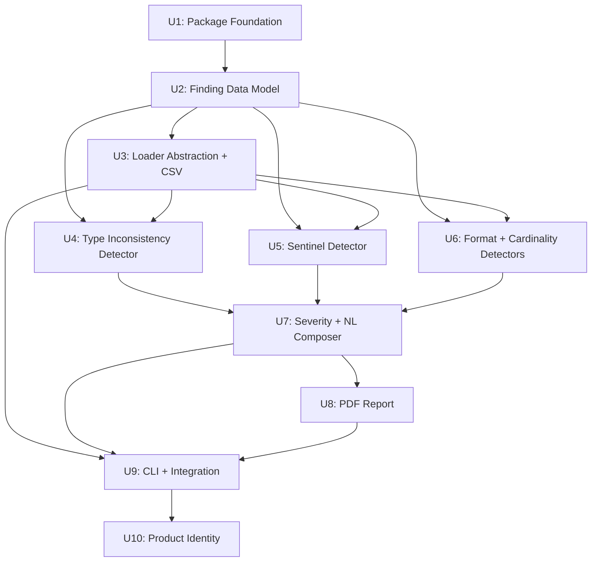

# feat: Transform field-story-scorer into data quality diagnostic tool

## Summary

Restructure the scorer.py monolith into a modular Python package built around a Finding data model. Each detector (type inconsistency, sentinel values, format issues, cardinality anomalies) produces structured findings that flow through severity classification and template-based NL composition into a professional PDF report. The v1 composite-scoring pipeline is replaced; the cell-level type detection engine (`load_strict`) becomes always-on. Excel and CSV are the supported input formats; database support is a stretch goal.

---

## Problem Frame

See origin for the full problem narrative (see origin: `docs/brainstorms/2026-05-14-data-quality-diagnostic-v2-requirements.md`). In brief: hidden data quality problems — silent type coercion, buried sentinel values, inconsistent formatting — break downstream systems. The bottleneck is articulation: translating what's wrong into language non-technical people can understand and act on. The current v1 tool scores columns 0-1 across abstract dimensions; v2 replaces that with specific, actionable findings.

---

## Requirements

- R1. Analyze Excel (.xlsx) and CSV. Database support (one engine) is a stretch goal
- R2. Cell-level type analysis always on — detect what pandas silently coerces
- R3. Detect hidden sentinel values buried in otherwise-typed columns
- R4. Detect type inconsistencies within columns (mixed types that surface tools mask)
- R5. Detect format inconsistencies: leading-zero mismatches and mixed date formats
- R6. Detect cardinality and uniqueness anomalies
- R7. Classify severity: critical (data corruption, silent errors), warning (fragile behavior), info (style/convention)
- R8. Express each finding as "assumption vs. reality"
- R9. Explain downstream business impact in plain English
- R10. Provide a specific fix recommendation per finding
- R11. Provide a plain-English prevention rule per finding
- R12. Order and group findings by severity
- R13. Generate a professional report suitable for client delivery
- R14. Design the report for non-technical readers
- R15. Include an executive summary with top-priority findings
- R16. Choose a new product name
- R17. Portfolio-grade code quality, documentation, and presentation

**Origin actors:** A1 (Data Consultant), A2 (Client Data Person / Developer), A3 (Upstream Data Creator)
**Origin flows:** F1 (Client Data Assessment), F2 (Developer Self-Service), F3 (Data Quality Case-Building)
**Origin acceptance examples:** AE1 (covers R2, R4, R8, R9, R11), AE2 (covers R5, R8, R11), AE3 (covers R1 — stretch), AE4 (covers R7, R12, R15)

---

## Scope Boundaries

### Deferred for later

- **v3: Executable validation code generation** — SQL constraints, spreadsheet validation formulas, schema definitions (see origin)
- Web UI or SaaS form factor
- Real-time or ongoing data quality monitoring
- Interactive / conversational mode
- HTML, Excel, or Markdown report formats (PDF only for v2)
- Database engines beyond the stretch-goal single engine
- Inconsistent code pattern detection (the third leg of R5 — leading zeros and mixed dates only for v2)

### Outside this product's identity

- General-purpose exploratory data analysis (EDA)
- Data cleaning or transformation
- ETL pipeline or data integration tooling
- Database administration or schema migration

### Deferred to Follow-Up Work

- Chart recommendations feature from v1 (not in v2 requirements, may revisit)
- Correlation matrix as a standalone report section (may become supplementary evidence in a future iteration)
- `generate_sample.py` rewrite for v2 test data — existing samples work for development; polished demo data is a post-ship task

---

## Context & Research

### Relevant Code and Patterns

- `scorer.py` — 791-line monolith containing the entire v1 tool: loader, 5 scoring functions, analysis driver, Excel writer, PDF writer, CLI
- `load_strict()` (scorer.py:33-67) — openpyxl cell-level type reader. Returns DataFrame with `dtype=object` to preserve raw Python types. This is the proven technical nucleus
- `score_type_consistency()` (scorer.py:95-125) — majority-type proportion with int/float normalization. The `normalize_type()` pattern carries forward
- `analyze()` (scorer.py:278-396) — orchestrator that computes all scores per column and returns 4 DataFrames. To be decomposed
- `write_pdf()` (scorer.py:546-695) — reportlab landscape PDF via `SimpleDocTemplate` + `platypus`. Style infrastructure (colors, table formatting) partially reusable
- `write_excel()` (scorer.py:403-539) — openpyxl workbook with 4 tabs. Color palette and conditional formatting patterns are professional quality
- `infer_field_type()` (scorer.py:202-234) — 8-type classification scheme with cardinality thresholds. Useful internally for v2 findings context
- `tests/test_scorers.py` (248 lines, 31 tests) — unit tests for all scoring functions
- `tests/test_analyze.py` (129 lines, 6 tests) — integration tests, strict-mode regressions

### Institutional Learnings

No `docs/solutions/` directory exists yet. Key implicit learnings from the v1 audit (PR #1):
- `dtype=object` is load-bearing for strict mode — without it, `pd.DataFrame()` silently infers types, defeating cell-level reading
- Correlation and field-type inference must branch on strict vs. standard mode — v1 had bugs where standard-mode logic ran on strict-mode object-dtype data
- The strict/standard dual-path design forces every function to be mode-aware. v2 eliminates this by making strict-types always-on

---

## Key Technical Decisions

- **Finding data model as the core abstraction**: Each detector produces `Finding` objects (field, finding_type, severity, assumption, reality, impact, fix_recommendation, prevention_rule, evidence). This replaces v1's DataFrames as the contract between analysis and presentation. The Finding model is also the extensibility boundary for v3 code generation — v3 adds a consumer that reads Finding objects and produces executable validation code.
- **Template-based NL composition**: Each finding type has a text template with slots for field name, counts, percentages, and examples. Deterministic, testable, no LLM dependency. Templates produce the "assumption vs. reality" framing, impact explanation, fix recommendation, and prevention rule for each finding.
- **CSV detection via raw-string type inference**: Python's `csv` module reads all values as strings. The CSV loader applies per-cell type inference (attempt numeric parse → datetime parse → boolean check → string fallback) to produce the same kind of type-per-cell data that openpyxl provides for Excel. This unifies the downstream detector interface.
- **Sentinel detection via built-in list + frequency heuristic**: A configurable list of common sentinel strings ("N/A", "TBD", "pending", "—", "NULL", etc.). Frequency disambiguation: if a sentinel candidate is the majority value type in a column (>50%), it's treated as a legitimate category, not a sentinel.
- **R5 scoped to leading zeros and mixed dates for v2**: Inconsistent code pattern detection is more speculative and deferred. Leading-zero detection serves the product-code/UPC use case directly (AE2). Mixed-date detection is well-defined and implementable.
- **PDF as sole report format**: reportlab is an existing dependency and PDF is the professional standard for client deliverables. One format done well beats three done poorly.
- **Always-on strict types eliminates the dual-path architecture**: v1's `--strict-types` flag creates conditional branches throughout `analyze()`. v2 makes cell-level type analysis the default and only path, simplifying every function.
- **pyproject.toml + ruff for packaging and code quality**: Modern Python packaging with proper entry points, metadata, and dev dependencies. ruff for linting and formatting to meet the portfolio-grade bar (R17).

---

## Open Questions

### Resolved During Planning

- **Which database engines for v2?** SQLite as the stretch-goal engine — simplest, no server required, good for demos. Architecture supports adding others via the loader abstraction. (R1)
- **Report format?** PDF only via reportlab. Matches "hand to a client" use case. (R13-R15)
- **Codebase structure?** Modularize into a proper Python package. Single-file design cannot absorb v2's scope. (R17)
- **Engine extensibility for v3?** Finding data model is the abstraction boundary. v3 adds a code-generation consumer that reads Finding objects.
- **Severity classification model?** Defined in R7 with concrete criteria. Implementation: each detector tags findings with severity based on the criteria.
- **CSV detection strategy?** Raw-string reading via `csv` module + per-cell type inference. The only viable approach since CSV has no type metadata.
- **Database detection strategy?** Deferred as stretch goal. Architecture supports it via the loader abstraction.
- **Do audiences need different formats?** One report serves all three audiences. The "assumption vs. reality" framing is audience-agnostic — consultants deliver it, developers act on it, upstream creators can understand it.
- **NL generation approach?** Template-based composition. Deterministic, testable, no external dependency.
- **Sentinel detection strategy?** Built-in configurable list + frequency heuristic.
- **R5 splitting?** Leading-zero detection + mixed-date detection for v2. Code pattern detection deferred.
- **Report format for R13-R15?** PDF. Executive summary as the first section, findings grouped by severity.

### Deferred to Implementation

- **Exact sentinel list contents**: Initial list will be refined during implementation as real-world test data surfaces edge cases
- **Date format detection heuristics**: Exact parsing strategies (dateutil vs. custom patterns) determined during implementation
- **Product name (R16)**: Explored during U10 with user input. Working name used as placeholder until then
- **PDF layout details**: Exact page layout, fonts, spacing finalized during U8 when working with actual finding content

### From 2026-05-14 review

- **loaders/base.py single-consumer abstraction** — Output Structure / U3 (P1, scope-guardian, confidence 100)

  Only two concrete loaders exist (Excel, CSV), selected by file extension dispatch — not dependency injection. A Protocol or base class in `loaders/base.py` may be premature abstraction when a function signature (`Path -> LoaderResult`) suffices. Consider whether the separate file earns its keep or whether the contract is adequately expressed by the type annotation on the dispatch function.

  <!-- dedup-key: section="output structure  u3" title="loadersbasepy singleconsumer abstraction" evidence="only two concrete loaders exist excel csv selected by file extension dispatch" -->

- **analyzers/base.py single-consumer abstraction** — Output Structure / U4 (P1, scope-guardian, confidence 100)

  Same concern as loaders: only four concrete analyzers exist, all called in a flat loop. A Protocol or base class in `analyzers/base.py` adds a file and an abstraction layer for a pattern that could be a type alias (`Callable[[LoaderResult], list[Finding]]`). Consider whether the base file earns its keep.

  <!-- dedup-key: section="output structure  u4" title="analyzersbasepy singleconsumer abstraction" evidence="same concern as loaders only four concrete analyzers exist all called in a flat loop" -->

- **Evidence dict untyped protocol** — U2 Finding Data Model (P1, adversarial, confidence 75)

  The Finding model uses `evidence: dict` without specifying what keys/values each FindingType populates. Type inconsistency evidence needs `majority_type`, `minority_type`, `counts`; sentinel evidence needs `sentinel_values`, `column_type`; etc. Without per-type documentation or typing, the contract between detectors and the template engine is implicit. Consider a TypedDict per FindingType or at minimum documenting the expected keys.

  <!-- dedup-key: section="u2 finding data model" title="evidence dict untyped protocol" evidence="the finding model uses evidence dict without specifying what keysvalues each findingtype" -->

- **findings/ sub-package may be over-structured** — Output Structure (P2, scope-guardian, confidence 75)

  The `findings/` sub-package contains 4 files (`__init__.py`, `severity.py`, `composer.py`, `templates.py`). `composer.py` and `templates.py` are closely coupled; `severity.py` is small. These could live as top-level modules in the package without the sub-package layer. Consider flattening if the sub-package doesn't provide meaningful organization beyond grouping.

  <!-- dedup-key: section="output structure" title="findings subpackage may be overstructured" evidence="the findings subpackage contains 4 files initpy severitypy composerpy templatespy" -->

- **Sentinel frequency heuristic unreliable on mostly-bad data** — U5 / Key Technical Decisions (P2, adversarial, confidence 75)

  The >50% frequency threshold for sentinel disambiguation fails when a column is predominantly bad data (e.g., 90% "N/A" and 10% real values). The heuristic treats "N/A" as a legitimate category, but the column is actually mostly bad data. The Risks section documents this as configurable, but the failure mode could silently suppress critical findings. Consider whether an additional signal (e.g., column-level type context) could disambiguate better.

  <!-- dedup-key: section="u5  key technical decisions" title="sentinel frequency heuristic unreliable on mostly bad data" evidence="the 50 frequency threshold for sentinel disambiguation fails when a column is predominantly bad" -->

---

## Output Structure

```
[product-name]/
    __init__.py
    __main__.py
    cli.py
    models.py              # Finding, Severity, FieldProfile dataclasses
    loaders/
        __init__.py
        base.py            # Loader protocol/base (file dispatch)
        excel.py           # openpyxl cell-level loader (from load_strict)
        csv_loader.py      # raw-string type inference loader
    analyzers/
        __init__.py
        base.py            # Analyzer protocol/base
        type_consistency.py
        sentinel.py
        format_check.py    # leading zeros, mixed dates
        cardinality.py
    findings/
        __init__.py
        composer.py        # NL template engine
        severity.py        # severity classification
        templates.py       # finding text templates
    reports/
        __init__.py
        pdf.py             # reportlab PDF report
tests/
    __init__.py
    test_models.py
    test_loaders.py
    test_type_consistency.py
    test_sentinel.py
    test_format_check.py
    test_cardinality.py
    test_severity.py
    test_composer.py
    test_report_pdf.py
    test_cli.py
    test_integration.py
pyproject.toml
```

---

## High-Level Technical Design

> *This illustrates the intended approach and is directional guidance for review, not implementation specification. The implementing agent should treat it as context, not code to reproduce.*

```
Input file (xlsx/csv)
        |
        v
   +---------+
   | Loader  |  --> LoaderResult(dataframe, cell_types, metadata)
   +---------+      Each cell has a raw Python type, not a pandas-inferred type.
        |           Excel: openpyxl cell-level types (existing load_strict)
        |           CSV: per-cell type inference from raw strings
        v
   +------------+
   | Analyzers  |  --> List[Finding]
   +------------+      Each analyzer examines the LoaderResult and produces
        |              Finding objects for the problems it detects.
        |              - TypeConsistencyAnalyzer: mixed types within columns
        |              - SentinelAnalyzer: hidden sentinel values
        |              - FormatAnalyzer: leading zeros, mixed dates
        |              - CardinalityAnalyzer: duplicate IDs, near-constant columns
        v
   +---------------------+
   | Severity Classifier  |  --> List[Finding] (with severity assigned)
   +---------------------+      Applies R7 criteria: critical / warning / info
        |
        v
   +------------+
   | Composer   |  --> List[Finding] (with NL text populated)
   +------------+      Templates fill: assumption, reality, impact,
        |              fix_recommendation, prevention_rule
        v
   +------------+
   | PDF Report |  --> output.pdf
   +------------+      Executive summary + findings by severity
                       Professional formatting for client delivery
```

---

## Implementation Units



### U1. Package Foundation

**Goal:** Transform the bare-script repo into a proper Python package with modern tooling.

**Requirements:** R17

**Dependencies:** None

**Files:**
- Create: `pyproject.toml`
- Create: `[product-name]/__init__.py`
- Create: `[product-name]/__main__.py`
- Modify: `requirements.txt` (keep for backward compat, point to pyproject.toml)
- Modify: `requirements-dev.txt` (add ruff, keep pytest)
- Modify: `.gitignore`
- Test: existing `tests/test_scorers.py`, `tests/test_analyze.py` (must still pass)

**Approach:**
- Create `pyproject.toml` with project metadata, `[project.scripts]` entry point, build system config, ruff config, pytest config
- Use a placeholder package name (e.g., `datascope`) until U10 finalizes the name
- Move all functions from `scorer.py` into the package as a temporary `_legacy.py` module so existing tests pass with a simple import path change. Key functions: `load_strict`, `load_standard`, `normalize_type`, all `score_*` functions, `infer_field_type`, `analyze`, `write_pdf`, `write_excel`, and their helpers. **Deletion gate:** `_legacy.py` is removed when U9 is complete and all tests pass without it
- Configure ruff with reasonable defaults (not a full lint-fix pass yet — that happens incrementally across units)
- Add `__main__.py` for `python -m [package]` invocation
- Remove `warnings.filterwarnings("ignore")` — v2 handles warnings explicitly

**Patterns to follow:**
- `pyproject.toml` conventions for Python 3.10+ projects with `[build-system]` using setuptools
- Existing test import pattern (`from scorer import ...`) updated to package imports

**Test scenarios:**
- Happy path: `pip install -e .` succeeds and `python -m [package] --version` prints version
- Happy path: existing tests pass with updated imports
- Edge case: `python -m [package]` with no args prints usage help
- Error path: package import from outside the repo works after editable install

**Verification:**
- All existing tests pass
- `pip install -e .` works
- ruff check passes (or has a known-clean baseline)

---

### U2. Finding Data Model

**Goal:** Define the core data structures that all detectors produce and all downstream consumers (severity classifier, NL composer, report writer) consume.

**Requirements:** R7, R8, R9, R10, R11, R12

**Dependencies:** U1

**Files:**
- Create: `[product-name]/models.py`
- Test: `tests/test_models.py`

**Approach:**
- `Finding` dataclass with fields: `field_name`, `finding_type` (enum), `severity` (enum: critical/warning/info), `assumption` (str), `reality` (str), `impact` (str), `fix_recommendation` (str), `prevention_rule` (str), `evidence` (dict — counts, examples, percentages)
- `Severity` enum: CRITICAL, WARNING, INFO with ordering support for R12
- `FindingType` enum: TYPE_INCONSISTENCY, SENTINEL_VALUE, FORMAT_INCONSISTENCY, CARDINALITY_ANOMALY (extensible for v3)
- `LoaderResult` dataclass: `dataframe` (pd.DataFrame), `cell_types` (dict mapping column to list of per-cell Python types), `source_metadata` (dict — filename, sheet name, row count, column count)
- `FieldProfile` dataclass for per-column summary data (completeness ratio, unique count, inferred type, type breakdown)
- All text fields on Finding start as None — detectors populate evidence and finding_type; severity classifier assigns severity; NL composer fills assumption/reality/impact/fix/prevention

**Patterns to follow:**
- Python dataclasses with `__post_init__` validation where needed
- Enum with ordering (`@total_ordering` or IntEnum-like severity comparison)

**Test scenarios:**
- Happy path: create a Finding with all fields populated, verify all fields accessible
- Happy path: Severity ordering — CRITICAL > WARNING > INFO for sorting
- Happy path: FindingType enum contains all four detector types
- Edge case: Finding with None text fields (pre-composition state) is valid
- Edge case: LoaderResult with empty DataFrame is valid
- Happy path: sort a list of Findings by severity, verify critical comes first

**Verification:**
- All model classes instantiate correctly
- Severity ordering supports R12's sort-by-severity requirement
- LoaderResult carries cell-type data separate from the DataFrame

---

### U3. Loader Abstraction and CSV Support

**Goal:** Extract the Excel loader from `load_strict`, create a CSV loader with equivalent type-per-cell resolution, and unify both behind a common interface that returns `LoaderResult`.

**Requirements:** R1, R2

**Dependencies:** U2

**Files:**
- Create: `[product-name]/loaders/__init__.py`
- Create: `[product-name]/loaders/base.py`
- Create: `[product-name]/loaders/excel.py`
- Create: `[product-name]/loaders/csv_loader.py`
- Test: `tests/test_loaders.py`

**Approach:**
- **Loader interface**: a function or protocol that takes a file path and returns `LoaderResult`. File extension determines which loader is called.
- **Excel loader**: extract `load_strict()` from scorer.py. openpyxl `load_workbook(data_only=True, read_only=True)`, iterate cells, capture Python types. Returns `LoaderResult` with `cell_types` populated from openpyxl's native cell values (int, float, str, datetime, bool, NoneType).
- **CSV loader**: read with Python's `csv.reader` (raw strings). For each cell, attempt type inference in order: empty/null check → numeric parse (`int` then `float`) → boolean check ("true"/"false"/"yes"/"no") → datetime parse → string fallback. Return `LoaderResult` with `cell_types` populated from inference results.
- **Key invariant**: both loaders produce identical `LoaderResult` structure. Downstream analyzers never know which loader ran.
- Preserve the `dtype=object` DataFrame construction pattern from `load_strict` — this is load-bearing for preventing pandas from re-inferring types.

**Patterns to follow:**
- Existing `load_strict()` (scorer.py:33-67) for the Excel path
- `csv.reader` with explicit encoding handling for the CSV path

**Test scenarios:**
- Covers AE1. Happy path: CSV with mixed numeric/string column — loader detects both types per cell, returns correct cell_types
- Happy path: Excel file loaded — cell_types match openpyxl's native type detection
- Happy path: CSV with clean numeric column — all cells inferred as numeric
- Edge case: CSV with empty cells — cell_types records NoneType
- Edge case: CSV with quoted numbers ("123") — still inferred as numeric (quotes are CSV syntax, not content)
- Edge case: Excel with formula cells (data_only=True returns computed values)
- Edge case: CSV with BOM (UTF-8-BOM) — handled without error
- Error path: file not found — clear error message
- Error path: malformed CSV (mismatched quotes) — graceful error
- Integration: LoaderResult from Excel and CSV loaders have identical structure, can be passed to any analyzer

**Verification:**
- Both loaders return `LoaderResult` with populated `cell_types`
- CSV loader's type inference is functionally equivalent to openpyxl's type detection — both produce per-cell type classifications, though CSV inference may differ on edge cases (e.g., int vs. float distinction) since CSV has no native type metadata
- Existing strict-mode regression tests (test_analyze.py) pass when rewired to the new Excel loader

---

### U4. Type Inconsistency Detector

**Goal:** Detect mixed types within columns — the core "what pandas hides" capability. Produces Finding objects for columns where the apparent type masks a minority of different-typed values.

**Requirements:** R2, R4

**Dependencies:** U2, U3

**Files:**
- Create: `[product-name]/analyzers/__init__.py`
- Create: `[product-name]/analyzers/base.py`
- Create: `[product-name]/analyzers/type_consistency.py`
- Test: `tests/test_type_consistency.py`

**Approach:**
- **Analyzer interface**: takes a `LoaderResult`, returns `list[Finding]`. Each analyzer follows this contract.
- Extract the type-counting logic from `score_type_consistency()` and the `type_mix` string generation from `analyze()`. Instead of producing a 0-1 score, produce a Finding when mixed types are detected.
- **Detection logic**: any column with more than one non-null type triggers a finding. The proportion of minority-type values influences severity: >95% majority with contamination maps to CRITICAL (silently skewed calculations), while more evenly mixed columns (e.g., 50/50) map to WARNING (ambiguous column type). The majority threshold is configurable and defaults to 95%.
- Carry forward the `normalize_type()` pattern that collapses int/float into "numeric" to avoid false positives from openpyxl's int-vs-float distinction.
- Carry forward `_strict_majority_kind()` for boolean/datetime sniffing in object-dtype columns.
- Finding evidence includes: majority type, minority type, count of each, specific example values from the minority.

**Patterns to follow:**
- `score_type_consistency()` (scorer.py:95-125) for the normalization logic
- `analyze()` type_mix string generation (scorer.py:333-344) for evidence formatting

**Test scenarios:**
- Covers AE1. Happy path: column with 485 numeric + 15 string values — produces a Finding with correct counts and example strings
- Happy path: column with all numeric values — no Finding produced
- Happy path: column with 50/50 numeric/string — produces Finding (this is not a "majority with contamination" but genuine mixed-type)
- Edge case: column with int and float values only — no Finding (normalized to "numeric")
- Edge case: column with boolean and string values — produces Finding
- Edge case: column with all None/null — no Finding (nothing to detect inconsistency in)
- Edge case: single-row column — no Finding
- Edge case: column where minority type is None/null — only flag non-null minority types

**Verification:**
- Detects the AE1 scenario (485 numeric + 15 text) and produces a correctly structured Finding
- Does not false-positive on int/float normalization
- Existing type_consistency tests from test_scorers.py have equivalent coverage in the new test file

---

### U5. Sentinel Value Detector

**Goal:** Detect hidden sentinel values — strings like "N/A", "TBD", "pending" buried in otherwise-typed columns — that tools silently drop or coerce.

**Requirements:** R3

**Dependencies:** U2, U3

**Files:**
- Create: `[product-name]/analyzers/sentinel.py`
- Test: `tests/test_sentinel.py`

**Approach:**
- **Built-in sentinel list**: common sentinel strings normalized to lowercase for matching. Initial list: "n/a", "na", "n.a.", "null", "none", "nil", "tbd", "pending", "unknown", "missing", "—", "-", ".", "..", "...", "#n/a", "#ref!", "#value!", "#div/0!", "#name?". Configurable via a parameter.
- **Detection logic**: for each column in the LoaderResult, check cell values (as strings, lowercased) against the sentinel list. If sentinels are found in an otherwise-numeric or otherwise-typed column, produce a Finding.
- **Frequency disambiguation**: if a sentinel candidate constitutes >50% of non-null values in the column, it is likely a legitimate category value, not a sentinel. Skip it and do not produce a Finding for that value.
- Finding evidence includes: which sentinels were found, their count, the column's majority type, and specific cell examples.

**Patterns to follow:**
- Analyzer interface from U4 (takes LoaderResult, returns list[Finding])

**Test scenarios:**
- Happy path: numeric column with 3 "N/A" values — produces Finding identifying the sentinels
- Happy path: numeric column with "TBD" and "pending" — produces Finding listing both
- Happy path: column with no sentinels — no Finding
- Edge case: column where "N/A" is 60% of values — no Finding (frequency disambiguation treats it as legitimate)
- Edge case: column where "N/A" is 5% of values — produces Finding
- Edge case: string/categorical column with sentinel values — no Finding (sentinels in a string column are not hidden)
- Edge case: case sensitivity — "n/a", "N/A", "N/a" all match
- Edge case: empty string cells — not treated as sentinels (handled by completeness, not sentinel detection)
- Edge case: Excel error values ("#REF!", "#VALUE!") — detected as sentinels

**Verification:**
- Detects sentinel values ("N/A", "pending") in numeric columns and produces correctly structured Findings
- Does not false-positive on categorical columns where sentinel-like strings are legitimate values
- Frequency disambiguation prevents flagging majority-sentinel columns

---

### U6. Format and Cardinality Detectors

**Goal:** Detect leading-zero inconsistencies, mixed date formats, and cardinality anomalies (duplicate IDs, near-constant columns).

**Requirements:** R5, R6

**Dependencies:** U2, U3

**Files:**
- Create: `[product-name]/analyzers/format_check.py`
- Create: `[product-name]/analyzers/cardinality.py`
- Test: `tests/test_format_check.py`
- Test: `tests/test_cardinality.py`

**Approach:**
- **Leading-zero detection**: for string-typed columns, check if some values have leading zeros and others don't (same content with/without "0" prefix). Also detect columns where numeric values lost leading zeros during type coercion (e.g., "00123" stored as 123). Produce a Finding when inconsistency detected. **Excel limitation:** for cells already stored as numbers, the original string representation is irrecoverable — openpyxl returns the numeric value without leading zeros. Leading-zero detection for Excel is limited to string-typed cells. CSV is more reliable for this check since all values are read as raw strings before type inference.
- **Mixed-date detection**: for columns containing date-like values, parse a sample and check whether multiple date formats coexist (e.g., "01/15/2026" and "2026-01-15" in the same column). Produce a Finding when mixed formats detected.
- **Cardinality anomalies**: using the column's unique-value count and total count:
  - **Near-constant columns**: uniqueness ratio < 0.01 (fewer than 1% unique values) — Info-level finding
  - **Suspected duplicate IDs**: columns with high uniqueness (>95%) but not 100% — Warning-level finding suggesting the column may be intended as a unique identifier but has duplicates
  - These build on `score_cardinality()` logic but produce Findings instead of scores

**Patterns to follow:**
- `score_cardinality()` (scorer.py:81-92) for uniqueness ratio calculation
- `infer_field_type()` (scorer.py:202-234) for cardinality-based type classification thresholds
- Analyzer interface from U4

**Test scenarios:**
- Covers AE2. Happy path: product_code column with 230 leading-zero values and 270 without — produces Finding
- Happy path: date column with "01/15/2026" and "2026-01-15" — produces Finding identifying mixed formats
- Happy path: ID column with 1000 values, 998 unique — produces duplicate-ID Finding
- Happy path: column with 500 rows and 3 unique values — produces near-constant Finding
- Edge case: column with all leading zeros consistently — no Finding (consistent is fine)
- Edge case: numeric column (no string representation available) — leading-zero check skipped
- Edge case: column with 100% unique values — no duplicate Finding
- Edge case: column with 50% unique values — no cardinality Finding (not near-constant, not suspected ID)
- Error path: column with unparseable date-like strings — gracefully skip date format check for that column

**Verification:**
- Detects the AE2 scenario (leading zeros in product codes)
- Cardinality findings correctly identify near-constant and suspected-duplicate patterns
- Does not false-positive on intentionally low-cardinality columns (e.g., status fields)

---

### U7. Severity Classifier and NL Composer

**Goal:** Assign severity to raw detector findings using the R7 criteria, then populate each finding's human-readable text fields using the template engine.

**Requirements:** R7, R8, R9, R10, R11, R12, R14

**Dependencies:** U4, U5, U6

**Files:**
- Create: `[product-name]/findings/__init__.py`
- Create: `[product-name]/findings/severity.py`
- Create: `[product-name]/findings/composer.py`
- Create: `[product-name]/findings/templates.py`
- Test: `tests/test_severity.py`
- Test: `tests/test_composer.py`

**Approach:**
- **Severity classifier**: takes a list of raw Findings (with finding_type and evidence populated) and assigns severity based on downstream impact:
  - CRITICAL: findings where silent data loss or incorrect calculations will occur in downstream aggregation — e.g., mixed types causing rows to be silently excluded from sums/averages, sentinel values that pandas drops without warning
  - WARNING: findings where downstream key mismatches or misinterpretation are likely but not guaranteed — e.g., leading-zero inconsistency causing key lookup failures, mixed date formats risking wrong-date parsing, suspected duplicate IDs
  - INFO: findings that indicate data quality concerns without direct downstream breakage — e.g., near-constant columns, unusual cardinality patterns
  - Severity assignment is deterministic and rule-based, not ML
- **Template engine**: for each FindingType, a template that fills the four text fields:
  - `assumption`: "Column `{field}` appears to be {apparent_type}..."
  - `reality`: "...but {count} of {total} values are {actual_description}"
  - `impact`: what breaks or gets skewed (specific to finding type)
  - `fix_recommendation`: what to do now
  - `prevention_rule`: what right looks like going forward
  - Templates use the evidence dict for counts, percentages, and example values
- **Ordering**: sort findings by severity (CRITICAL first), then by finding_type within severity tier (R12)
- **Multi-finding columns**: when multiple detectors flag the same column (e.g., type inconsistency and sentinel detection both fire on a column with "N/A" in numeric data), present each as a separate, self-contained finding. The report groups findings by field_name within each severity tier so related issues appear together without fragmentation

**Patterns to follow:**
- Python string formatting (f-strings or `.format()`) for templates
- Enum-based dispatch for finding_type → template selection

**Test scenarios:**
- Covers AE1. Happy path: type inconsistency in numeric column → CRITICAL severity, populated assumption/reality/impact/fix/prevention text
- Covers AE2. Happy path: leading-zero inconsistency → WARNING severity, populated text including prevention rule
- Covers AE4. Happy path: 3 critical + 5 warning + 2 info findings → sorted with critical first, then warning, then info
- Happy path: sentinel in numeric column → CRITICAL severity
- Happy path: near-constant column → INFO severity
- Edge case: finding with zero evidence values — template handles gracefully (no division by zero, no empty strings)
- Edge case: very long field names — text wraps correctly in templates
- Integration: severity classifier + composer pipeline produces complete Finding objects ready for report

**Verification:**
- Every FindingType has a corresponding template that produces readable English text
- Text output matches the "assumption vs. reality" framing required by R8
- Each finding includes all four text fields: impact (R9), fix (R10), prevention (R11), and the assumption/reality framing (R8)
- Findings are ordered by severity tier (R12)

---

### U8. PDF Report Generation

**Goal:** Produce a professional PDF report with executive summary and findings grouped by severity — suitable for handing to a client.

**Requirements:** R13, R14, R15

**Dependencies:** U7

**Files:**
- Create: `[product-name]/reports/__init__.py`
- Create: `[product-name]/reports/pdf.py`
- Test: `tests/test_report_pdf.py`

**Approach:**
- **Report structure**:
  1. Title page: report title, source file name, date, finding count summary
  2. Executive summary: overall data health assessment, count by severity, top critical findings highlighted (R15)
  3. Findings by severity: critical section, warning section, info section. Each finding shows assumption, reality, impact, fix, prevention in a readable card-like layout (R12, R14)
  4. Field inventory: summary table of all columns analyzed with their detected types and any flags
- **reportlab approach**: `SimpleDocTemplate` with `platypus` flowables. Reuse v1's color palette where appropriate (the navy/teal/green scheme is professional). New paragraph styles for the assumption/reality/impact/fix/prevention structure.
- **Design for non-technical readers (R14)**: no jargon, no composite scores, no unexplained statistical metrics. Severity badges (Critical / Warning / Info) with color coding. Each finding is self-contained and readable without context from other findings.
- **Input**: takes a sorted list of complete Finding objects plus source metadata

**Patterns to follow:**
- `write_pdf()` (scorer.py:546-695) for reportlab patterns: `SimpleDocTemplate`, `Table`, `TableStyle`, `Paragraph`, `PageBreak`, `HRFlowable`
- v1's color palette: `NAVY = "1B2A4A"`, `TEAL = "2E86AB"`, etc.

**Test scenarios:**
- Happy path: generate PDF with 3 critical + 2 warning + 1 info finding — file created, non-zero size
- Covers AE4. Happy path: executive summary lists critical findings first, groups by severity
- Happy path: PDF renders without errors for findings with long text content
- Edge case: zero findings — report still generates with "no issues found" message
- Edge case: single finding — report structure still makes sense (no empty sections)
- Edge case: finding with very long field names or evidence text — no layout overflow
- Error path: output directory doesn't exist — created automatically or clear error
- Integration: end-to-end from LoaderResult → analyzers → classifier → composer → PDF report file

**Verification:**
- Generated PDF opens in a PDF reader without errors
- Executive summary is the first content after the title page
- Findings are visually grouped by severity with clear section headers
- No jargon, no composite scores visible in the report (R14)

---

### U9. CLI and Integration

**Goal:** Wire the full pipeline together behind a clean CLI interface. This is where the tool becomes usable.

**Requirements:** R1, R13, R17, F1, F2

**Dependencies:** U3, U7, U8

**Files:**
- Create: `[product-name]/cli.py`
- Modify: `[product-name]/__main__.py` (wire to cli.main)
- Modify: `pyproject.toml` (entry point)
- Test: `tests/test_cli.py`
- Test: `tests/test_integration.py`

**Approach:**
- **CLI interface**: `[tool-name] <input-file> [--output-dir DIR] [--sheet NAME_OR_INDEX]`
  - Input file type detected from extension (.xlsx, .csv)
  - Output directory defaults to `./reports`
  - Sheet argument only relevant for Excel files
  - `--version` flag
  - No `--strict-types` flag (always on)
- **Pipeline orchestration**: load → run all analyzers → classify severity → compose NL text → sort by severity → generate PDF → print summary to stdout
- **Stdout summary**: brief text output showing finding count by severity and top critical findings (similar to v1's top-5 but with the new severity framing)
- **Error handling**: clear error messages for unsupported file types, missing files, permission errors. No `sys.exit(1)` in library code — exceptions with messages, CLI catches and formats

**Patterns to follow:**
- v1's argparse structure (scorer.py:702-791) for basic patterns
- `RawDescriptionHelpFormatter` for help text formatting

**Test scenarios:**
- Covers F1, AE1. Happy path: `tool sample.xlsx --output-dir ./out` — produces PDF in output directory, prints summary
- Covers F2. Happy path: `tool data.csv` — CSV detected, analyzed, PDF generated
- Happy path: `tool --version` — prints version string
- Happy path: `tool --help` — prints usage with all options
- Edge case: output directory doesn't exist — created automatically
- Edge case: Excel file with named sheet — `--sheet` argument works
- Error path: unsupported file extension — clear error message
- Error path: file not found — clear error message
- Error path: empty file (0 rows) — graceful handling, report says no data
- Integration: full pipeline from CLI invocation through PDF generation, verified by checking output file exists and has expected structure

**Verification:**
- `pip install -e . && [tool-name] samples/input/sample_mixed_types.xlsx` produces a PDF report
- CLI help text is clear and professional
- Error messages are user-friendly, not tracebacks

---

### U10. Product Identity and Documentation

**Goal:** Apply the chosen product name, rewrite documentation for v2, and ensure portfolio-grade presentation.

**Requirements:** R16, R17

**Dependencies:** U9

**Files:**
- Modify: `pyproject.toml` (name, description, URLs)
- Modify: `[product-name]/` directory (rename to final name)
- Modify: `[product-name]/__init__.py` (version, package docstring)
- Create or rewrite: `README.md`
- Modify: `LICENSE` (update if needed)
- Modify: all test imports
- Test: all tests pass with new name

**Approach:**
- **Name selection**: present 3-4 name options to the user. Criteria from R16: communicates data quality diagnosis, plain-English accessibility, professional credibility. Must be available as a PyPI package name.
- **README rewrite**: problem statement, what the tool does, installation, usage examples with sample output, how to read the report, contributing guidelines. Include a sample finding screenshot or text excerpt.
- **Package metadata**: proper description, keywords, classifiers, project URLs in pyproject.toml
- **Version**: set to 2.0.0

**Patterns to follow:**
- Existing README.md structure (explains problem, methodology, usage) but rewritten for v2's diagnostic framing
- PyPI package naming conventions (lowercase, hyphens for display, underscores for imports)

**Test scenarios:**
- Happy path: all tests pass with the new package name
- Happy path: `pip install -e .` works with the new name
- Happy path: CLI entry point uses the new name
- Happy path: README renders correctly on GitHub (check markdown formatting)

**Verification:**
- Package installs and runs under the new name
- README is clear, professional, and accurately describes v2's capabilities
- No references to the old "field-story-scorer" name remain in active code (old name may remain in git history and docs/brainstorms)

---

## System-Wide Impact

- **Interaction graph:** CLI → loader dispatch → analyzer pipeline → severity classifier → NL composer → PDF report writer. Each boundary is a function call; no callbacks, middleware, or observers. The Finding data model is the only shared type crossing boundaries.
- **Error propagation:** Analyzers catch their own errors and skip individual columns rather than failing the entire analysis. Loader errors (bad file, unsupported format) propagate to the CLI as exceptions with user-friendly messages. Report generation errors propagate similarly.
- **State lifecycle risks:** No persistent state. Each CLI invocation is a fresh analysis. No caching, no database, no temp files beyond the output report.
- **API surface parity:** CLI is the only interface. No library API is promised for v2 (though the modular structure makes one possible in the future).
- **Integration coverage:** The critical integration path is: loader → analyzers → classifier → composer → PDF. Unit tests per module are necessary but not sufficient — `test_integration.py` must verify the full pipeline produces correct PDF output from known input data.
- **Unchanged invariants:** The v1 `scorer.py` file remains in the repo during development for reference but is no longer the entry point. Existing sample files in `samples/` continue to work as test inputs.

---

## Risks & Dependencies

| Risk | Mitigation |
|------|------------|
| CSV type inference produces different results than openpyxl for equivalent data | U3 test scenarios explicitly compare Excel and CSV loader output for the same logical data |
| reportlab's `platypus` layout is brittle with long text content | U8 tests include findings with long field names and evidence; layout tested with real content |
| Sentinel frequency heuristic may misclassify edge cases | Threshold (50%) is configurable; U5 tests cover the boundary |
| Template-based NL may produce awkward phrasing for unusual finding combinations | Templates are isolated in `templates.py` and easy to iterate on post-ship |
| Product rename (U10) touches every file — high risk of missed references | U10 runs a grep-based sweep for old name; all tests must pass after rename |
| Date parsing ambiguity (is "01/02/2026" Jan 2 or Feb 1?) | Document the assumption (US format default) and note as a future configurability option |

---

## Success Metrics

- A1 (consultant) can run the tool against a client dataset and deliver the PDF report as a professional service without rewriting findings
- A2 (developer) can read the report and understand what needs fixing, why, and how — without data expertise
- The tool detects the AE1 scenario (mixed types in a numeric column) and the AE2 scenario (leading-zero inconsistency) and produces correct, readable findings for both
- All findings include assumption, reality, impact, fix recommendation, and prevention rule (R8-R11)
- The codebase passes ruff checks, has test coverage for all analyzers, and is structured for maintainability

---

## Documentation / Operational Notes

- README.md is the primary documentation — rewritten in U10
- No deployment infrastructure needed (CLI tool, pip install)
- `docs/brainstorms/` contains the v2 requirements doc for reference
- `docs/plans/` contains this plan
- Consider creating `docs/solutions/` during or after v2 work to capture learnings for the compound-engineering workflow

---

## Sources & References

- **Origin document:** [docs/brainstorms/2026-05-14-data-quality-diagnostic-v2-requirements.md](docs/brainstorms/2026-05-14-data-quality-diagnostic-v2-requirements.md)
- Related code: `scorer.py` (v1 monolith — source for `load_strict`, scoring functions, report patterns)
- Related PRs: #1 (v1 audit — strict-mode fixes, test suite addition)
- Python packaging: pyproject.toml with setuptools build backend
- reportlab: platypus flowables for PDF generation
